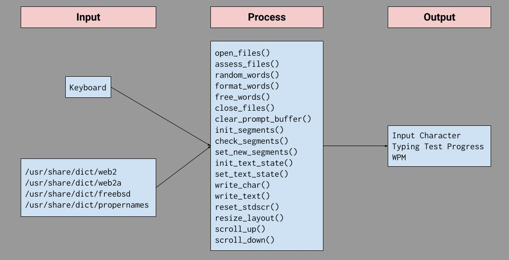
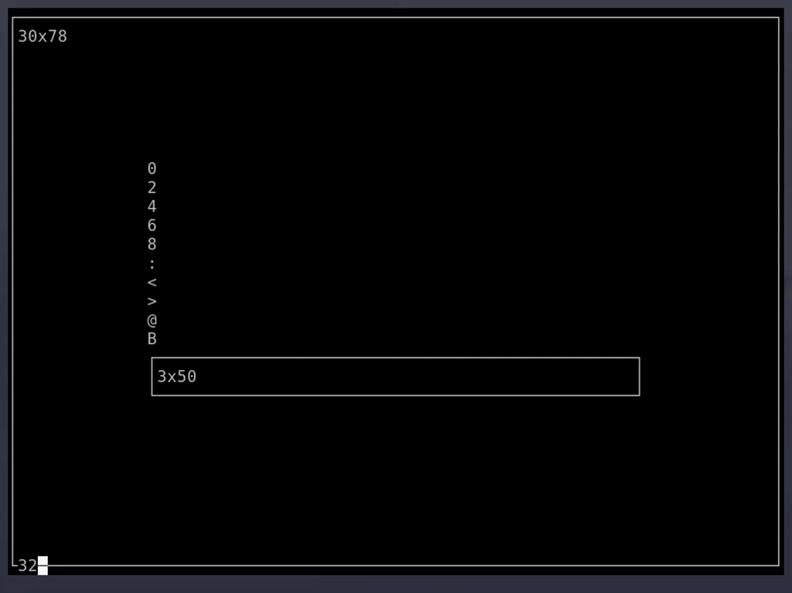
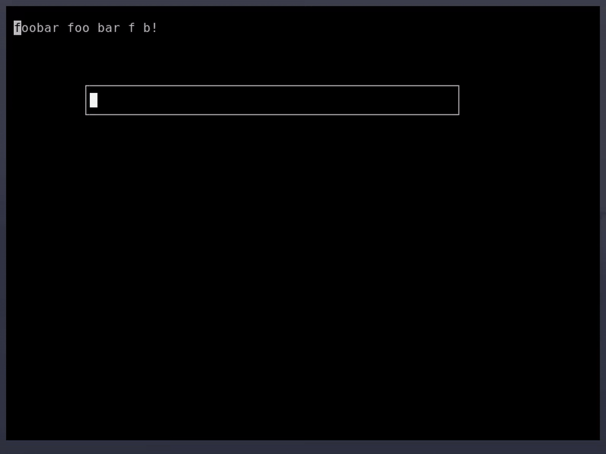

# Design

The IPO diagram is based on three prototype implementations:
* 06test.c  (UI Layout)
* u4test.c  (Keyboard IO)
* main.c    (Random Text)

Each implementation is shown below in their respective order.

