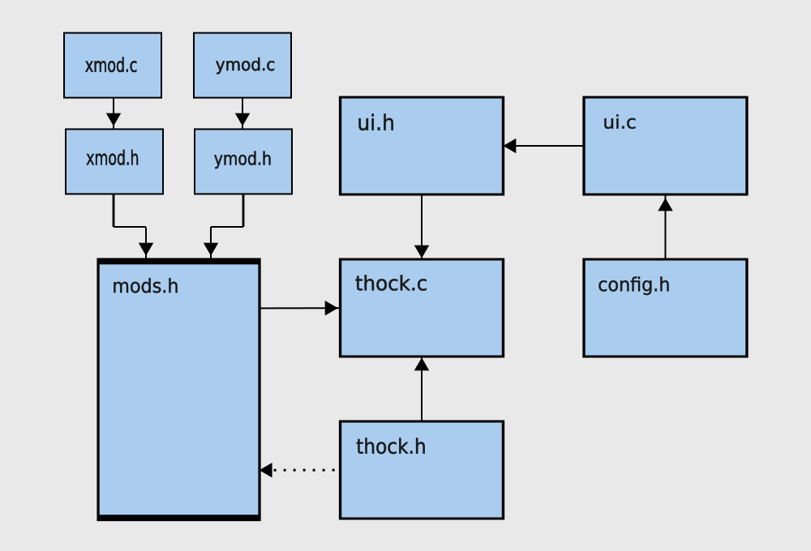

# Devlog

> summary

## Design (Pt1)

The IPO diagram is a result of three prototype implementations:
1. main.c
2. u4test.c
3. 06test.c

Each file demonstrates key features the application should have (see below).

### main.c (Generate Random Text)
* retrieve random wordset
* print wordset within column constraints

### u4test.c (Keyboard I/O)
* visual char comparison (green=correct, red=incorrect)
* prompt clearing on segment completion
* segment locking after completion (cannot backspace into completed segments)

### 06test.c (UI Layout)
* dynamic window resizing
* scrollable text

## Design (Pt2)

Header files outline

| thock.h            | ui.h            | xdata.h         |
|--------------------|-----------------|-----------------|
| request ext data   | win properties  | parse data      |
| request kbd input  | win functions   | allocate memory |
| track state        | key definitions |                 |
| track status       | i/o processes   |                 |
| track data sources |                 |                 |

Essentially, thock.h is main and overlooks program data + progress. 
Any output display of the data is handled by the ui.h, as well as ui functions like resizing, refreshing, scrolling, etc. 
xdata.h (==where x equals type-of-data==) is any type of external data source. For example, [above](#main.c-(generate-random-text), 20 random words are retrieved through FreeBSD dictionary files, thus the xdata.h file could be dictdata.h. General cases could include: txtdata.h, jsondata.h, xmldata.h. etc.

## Design (Pt3)

* thock.c - contains program entry and is still expected to request keyboard input, request wordsets, track progress, track states, and track data modules
* thock.h - primarily declares a extern array, modules, that is inititialized in mods.h

* ui.c - ui implementations for windows, keyboard input, and function key definitions
* ui.h - common header for c file

* config.h - configurable variables to change ui components
* mods.h - module array initialization containing all the modules that are compiled that supply wordsets to thock.c

* (x/y)mod.c , (x/y)mod.h - any external module that can serve an appropriate wordset to thock.c and are plugged into mods.h

This design (hopefully) encourages external modules to be easily defined as needed and simply included in the mods.h file without having to make major altercations to thock or ui files. Same with config.h, ui look and feel can be changed through a few variables there without needed to dig into ui files.

Overall, the goal is for quick configuration/extensibility through 2 files: mods.h , config.h
